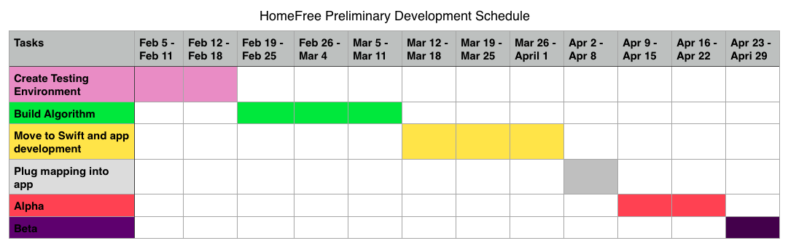

# HomeFree's Software Development Plan

### Table of Contents

 - [4.1 Plan Introduction](#41-plan-introduction)

 - [4.2 Project Resources](#42-project-resources)

 - [4.3 Project Organization](#43-project-organization)

 - [4.4 Project Schedule](#44-project-schedule)

### 4.1 Plan Introduction

This Software Development Plan provides the details of the planned development for the HomeFree routing algorithm and application which provides routing directions in the safest fashion. The algorithm focuses on building routs with mainly right hand turns and avoiding left hand turns, and therefore safer driving paths are developed.

#### 4.1.1 Project Deliverables
 - Testing Environment DUE: 2/6/17
     - This environment will help visualize the outcomes of algorithm development.
     - Instead of simply looking at jquery objects, the route will also be visualized on a front end
     - Results are clear and instantly implemented  
 - Right Priority Routing Algorithm DUE: 3/6/17
     - The main deliverable of the project
     - Most time consuming
     - Most of the semester's focus is on building this algorithm using OSRM's routing API.
 - Mobile (iPhone) Frontend Development DUE: 4/11/17
     - This is an optional feature of the application
     - Purpose of this feature is for me to become familiar with Swift
 - Mobile (iPhone) Application DUE: 5/2/17
     - A hopeful and ambitious deliverable
     - Connecting the OSRM API with the front end developed on Swift
     - Swift and d3 compatibility required

### 4.2 Project Resources
#### 4.2.1 Hardware Resources
##### Development Machine

An apple laptop is used for the development of the application with the following attributes:
 - MacBook Air(11-inch, Early 2014)
 - 1.4 GHz Intel Core i5
 - 4 GB RAM

##### Online Application Host
A website will be the intial instance of the application. This is where the testing environment exists and algorithm testing occurs. The downside to this format is it's inaccessibility to users who are in their cars.
 - HTML 5 Support
 - Chrome, Safari, Firefox, Edge(Internet Explorer), Opera

##### Optional Mobile (iPhone) Application Host

An apple phone may possibly host the application. My personal device will be used for testing*****. It has the following attributes:
 - iPhone 7
 - 2 GB RAM

 *****Other devices such as iPhone 6 and iPhone 7+ will be available for testing as well.

#### 4.2.2 Software Resources
###### Text Editor
 - Atom: v1.15.0
 - XCode (potentially)

###### Interpreter and Executer
 - Node v7.0.0

###### Version Control
 - Git v2.10.1

###### Third Party Software
 - [OSRM](http://project-osrm.org/)
 - [OpenStreetMap](http://www.openstreetmap.org/#map=9/39.2886/-104.9002)

###### Operating Systems
 - macOS Sierra v10.12.3
 - iOS v10.2.1

### 4.3 Project Organization
This individual project will be divided into the following major functions:
 - Development
 - Documentation
 - Delivery

#### Development
Development will be segmented into major accomplishments with set due dates. If due dates are not met, it is important that I reach out for outside help to prevent major set backs.

#### Documentation
Development must be balanced with important documentation responsibilities. The Software Documents will be not only accomplished within given time frames but also continuously updated as development progresses and things are subject to change.

#### Delivery
The development and documentation will work together to provide a ground for full delivery. Development will help with presenting demos, while documentation helps articulate the application.

### 4.4 Project Schedule
#### 4.4.1 GANTT Chart

#### 4.4.2 Task / Resource Table

| Task  | Resources |
|-------|---------|
| Create Testing Environment | Frontend Developer, Computer, OSRM Api, Node|
| Build Algorithm | Backend Developer, Computer, OSRM, C++ |
| Move to Swift (App Development) | App Developer, Computer, XCode |
| Plug Mapping into App | Backend Developer and Integration, Computer, iPhone, XCode, OSRM Api  |
| Alpha | Bug Fixers, Cleaning, biased feedback |
| Beta | Strangers for unbiased testing and feedback, different iPhone models, bug fixing

#### 4.4.3 Class Schedule
 - Class Meets Mondays 4:20-7:20 in the KeckLab
 - [Full schedule here](http://myweb.lmu.edu/bjohnson/cmsi402web2/classnotes.html)
